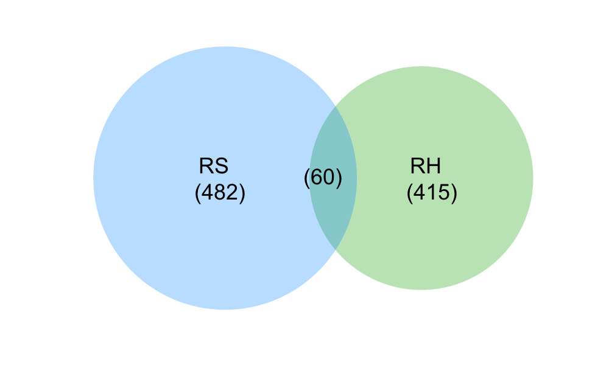
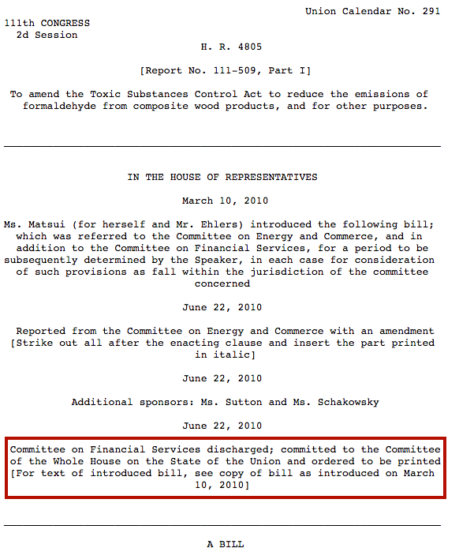
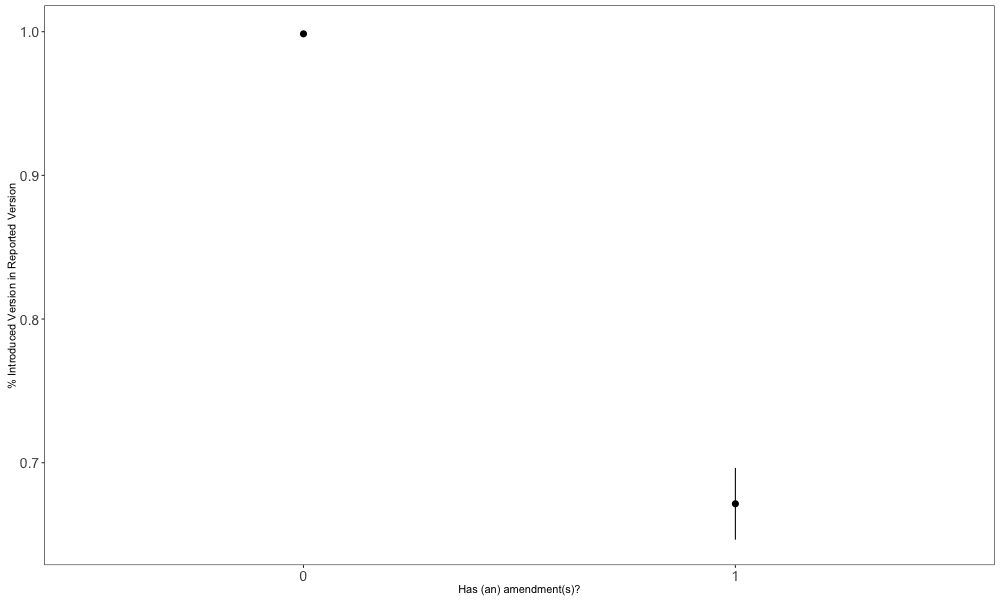
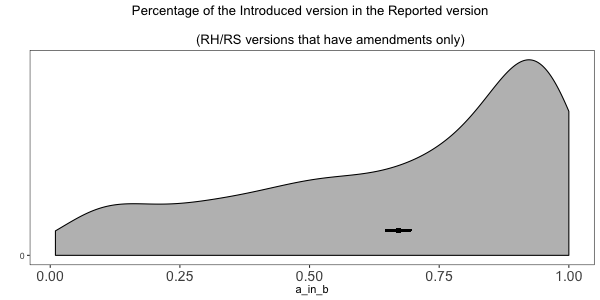

```{r, echo = FALSE, warning = FALSE, message =  FALSE}
library(qdap)
library(pander)
library(grid)
library(png)
library(venneuler)
```

______
### Goals of this report:

- Get more information about the 11th Congress
- To know how many bills went beyond being introduced in the House and Senate (IH or RH)
- To know how many versions were reported by one or multiple Committees in the House or the Senate (RH and/or RS)
- To know how many of the reported version had amendments v. no amendments

______

&nbsp;

Load Packages and Data (metadata for the 111th Congress)
```{r message = FALSE, warning = FALSE}
library(dplyr)
library(ggplot2)
load("../data/new_metadata_111.Rdata")
```

&nbsp;

## A) For how many bills of the 111th Congress do we have more than 1 version?

The whole metadata dataset for the 111th Congress has 14,690 bill versions for 10,439 unique bills
```{r, results = TRUE}
dim(meta)
length(unique(meta$BillID))
```

These include all bill versions. The variable `Type` indicates whether a bills is a `Final_Version` or an `Additional_Version`. However, the last version of each bill (`Final_Version`) appears twice (it also appears as `Additional_Version`). Moreover, we are not really interested at this point in those that were only introduced in the House or the Senate and never went anywere. To have a dataset with metadata for unique versions of bills that went beyond being introduced, we need to get rid of all the `Final_Version`. 

```{r, results = TRUE}
meta2 <- meta %>% filter(Type == "Additional_Version")
dim(meta2)
length(unique(meta2$BillID))
```


**Answer to A:**

For 1,238 bills we have more than one versions: 4,263 versions in total.
```{r, results = "asis", echo = FALSE}
bills_table <- data.frame(ALL = c(length(unique(meta$BillID)), nrow(meta)),
           RH_RS = c(length(unique(meta2$BillID)), nrow(meta2)))
rownames(bills_table) <- c("bills", "bill versions") 
colnames(bills_table)[2] <- "RH/RS+"
# pandoc.table(bills_table, style="rmarkdown")
```

|       &nbsp;        |  ALL  |  RH/RS+  |
|:-------------------:|:-----:|:--------:|
|      **bills**      | 10439 |   1238   |
|  **bill versions**  | 14690 |   4263   |

&nbsp;

## B) How many versions are Reported in the House (RH) and Reported in the Senate (RS) versions?

```{r}
rh <- meta[meta$version_type == "RH", ]
rh_bill_id <- rh$BillID
rs <- meta[meta$version_type == "RS", ]
rs_bill_id <- rs$BillID
both <- rh_bill_id[which(rh_bill_id %in% rs_bill_id)]
```

```{r, echo = FALSE}
png("../images/reported_versions_venn_diagram.png", width = 1000, height = 600)
v <- venneuler(c(RH = nrow(rh), RS = nrow(rs), "RH&RS" = length(both)))
v$labels <- ""
plot(v, border = FALSE, cex.lab = 5)
text("(60)", x = .5, y = .5, cex = 3)
text("RH \n (415)", x = .75, y = .5, cex = 3)
text("RS \n (482)", x = .25, y = .5, cex = 3)
dev.off()
```

<p align="center">
  RH and RS versions for the 111th Congress
  
</p>

&nbsp;

### C) How many RH and RS introduce amendments? What language do they use in the text to indicate so?

Some RH and RS versions introduce amendments while others don’t. The ones that introduce amendments do not always use the same language to indicate so. Most of them say:

- (RH) "*Reported from the Committee on* [name_of_the_committee] *with an amendemnt*"
- (RH) "*Reported from the Committee on* [name_of_the_committee] *with amendments*"
- (RS) "*Reported by* [mr_ms_name_committee_chair], *with an amendment*"
- (RS) "*Reported by* [mr_ms_name_committee_chair], *with amendments*"

Usually, after indicating that they introduce amendments, they indicate the way they are introducing them to the text:

- "Strike out all …"
- "Strike all after …"
- "Omit the part struck through …"

See the beginning of the RH version of 111-HR-4805 as an example:

<p align="center">
  
</p>

&nbsp;

To know which RH and RS introduce amendments, we need to search the top part of the document for the keywords "with amendments", "with an amendment", "strike", and "omit". To know which don't introduce amendments, we need to search the top part for the keyowrds "without an amendment" and "without amendments". 

We start by creating an empty dataset that will contain this information.
```{r}
amend_info <- as.data.frame(matrix(ncol = 6))
colnames(amend_info) <- c("billid", "version", "strike", "omit",
                          "with_amendment", "no_amendment")
amend_info <- read.csv("../data/amend_info.csv")
```

And now we fill out the empty dataset. For each bill with an RH and/or RS version, we import the text of that version, we take the top part of the document (which contains the information we are concerned about), and check whether it contains the keywords/regex.
```{r eval = FALSE}
rh2 <- dplyr::select(rh, BillID, version_type, Text_File_Index)
rs2 <- dplyr::select(rs, BillID, version_type, Text_File_Index)
both2 <- rbind(rh2, rs2)
for (i in 1:nrow(both2)) {
  bid <- both2$BillID[i]
  vtype <- both2$version_type[i]
  ref <- both2$Text_File_Index[i]
  filename <- paste0("~/Desktop/bills_text/", "Bill_", ref, ".txt")
  full_text <- paste(qdap::clean(readLines(filename)), collapse = "\n")
  lower_bill <- tolower(full_text)
  cuts <- gregexpr("\\_{10,}", full_text)
  front_cut <- as.numeric(cuts[[1]])[1] + attr(cuts[[1]], "match.length")[1]
  end_cut <- as.numeric(cuts[[1]])[2]
  bill_front <- qdap::clean(tolower(substring(full_text, front_cut, end_cut)))
  has_strike_out <- grepl("strike", bill_front)
  has_omit <- grepl("omit", bill_front)
  has_amendment <- grepl("with an amendment", bill_front)
  if (!has_amendment) {
    has_amendment <- grepl("with amendment", bill_front)
  }
  no_amendment <- grepl("without an amendment)", bill_front)
  if (!no_amendment) {
    no_amendment <- grepl("without amendment", bill_front)
  }
  new_row <- c(both2$BillID[i], both2$version_type[i],
               has_strike_out, has_omit, has_amendment, no_amendment)
  new_row[new_row == TRUE] <- 1
  new_row[new_row == FALSE] <- 0
  amend_info[i,] <- new_row
}
# write.csv(amend_info, file = "./data/amend_info.csv", row.names = FALSE)
```

Adding an extra variable to the table: whether in the text there is any keyword indicating to amendment introduciton ("with an amendment", "with amendments", "strike", or "omit").
```{r}
amend_info$any_amend_ref <- 0
amend_info$any_amend_ref[amend_info$omit == 1 | amend_info$strike == 1 |
                           amend_info$with_amendment == 1] <- 1
```

You can explore the resulting dataset with amendment information for the RH and RS versions (n = 897) [here](https://github.com/CasAndreu/Bills-Reuse/blob/master/data/amend_info.csv)

However, let's take a look at a summary table
```{r}
amend_summary <- amend_info %>%
  tidyr::gather(var, value, -billid, -version) %>%
  filter(value == 1) %>%
  group_by(version, var) %>% 
  summarize(n = n())
# pandoc.table(amend_summary, style="rmarkdown")
```

|  version  |      var       |  n  |
|:---------:|:--------------:|:---:|
|    RH     | any_amend_ref  | 280 |
|           |      omit      |  5  |
|           |     strike     | 268 |
|           | with_amendment | 274 |
|           |                |     |
|    RS     | any_amend_ref  | 275 |
|           |  no_amendment  | 205 |
|           |      omit      | 68  |
|           |     strike     | 201 |
|           | with_amendment | 275 |

This table shows that 274 RH versions had the words "with (an) amendment(s)" + "strike" OR "omit", but 6 of them had "strike" OR "omit" but did NOT have "with (an) amendemnt(s)", which seems weird. However, I have manually explored these versions and yes, they are introducing amendments but do not use the keywords "with (an) amendments(s)". See examples [111-HR-1771](https://www.gpo.gov/fdsys/pkg/BILLS-111hr1771rh/html/BILLS-111hr1771rh.htm) and [111-HR-3239](https://www.gpo.gov/fdsys/pkg/BILLS-111hr3239rh/html/BILLS-111hr3239rh.htm). 

Moreover, RH versions that don't have an amendment do not indicate so by using the "without (an) amendment(s)" expression. See example [111-HR-1002](https://www.gpo.gov/fdsys/pkg/BILLS-111hr1002rh/html/BILLS-111hr1002rh.htm).

The table also shows that all the RS versions that have the keyowrds "strike" and "omit" also have the keywords "with (an) amendment(s)". Contrary to the RH versions, this seems to suggest that RS versions always use the expression "with (an) amendment(s)" when introducing amendments. 

There are then 275 RS that introduce amendments. This means that there should be 207 RS versions (485 - 275) that have the keywords "without (an) amendment(s)". However, there are only 205 of them, which means that there are 2 RS versions that don't say if they introduce amendments or not: [111-S-2799](https://www.gpo.gov/fdsys/pkg/BILLS-111s2799rs/html/BILLS-111s2799rs.htm) and [111-S-3729](https://www.gpo.gov/fdsys/pkg/BILLS-111s3729rs/html/BILLS-111s3729rs.htm). After taking a look at them, they don' seem to introduce any amendemnt. 

In sum, this data suggests: 

|  version  |   amendment     |  n  |
|:---------:|:---------------:|:---:|
|    RH     | WITH amendment  | 280 |
|           |  NO amendment   | 135 |
|           |                 |     |
|    RS     | WITH amendment  | 275 |
|           |  NO amendment   | 207 |

&nbsp;

### D) Are the RH/RS versions that we detected as not introducing any amendments (RH = 135 & RS = 207) the same as the Introduced version (IH/IS)?

Load the dataset containing the comparisons for the 111th Congress
```{r}
load("../data/comparisons_111_Aug24.Rdata")
```

Selecting only those rows that have RH or RS as `version_a` or `version_b` AND IH or IS as `version_a` or `version_b`. 
```{r}
comps <- comparisons_full %>% 
  filter((version_a %in% c("RH", "RS") | version_b %in% c("RH", "RS")) & 
           (version_a %in% c("IH", "IS") | version_b %in% c("IH", "IS")))
dim(comps)
```

The resulting comparisons dataset has 897 observations, 41 more than the observations in `amend_info`. If we look at the unique bills (because some of 897 are versions of the same bill that have been reported in the House and in the Senate), we still see a difference. 

```{r}
length(unique(comps$BillID))
length(unique(amend_info$billid))
```

We have 836 unique bills in `amend_info` and 802 unique bills in `comps`. All bills in `comps` are in `amend_info`, but which bills in `amend_info` are not in `comps`?

```{r}
bills_not_in_comps <-unique(amend_info$billid)[which(!(unique(amend_info$billid) 
                                               %in% unique(comps$BillID)))]
bills_not_in_comps
```

If we check whether the first of these bills is in the overall metadata dataset, we see that it's there. However, we don't have a IH version. Then the difference between the number of bills in `amend_info` and `comps` dataset is because we were filtering the comparisons dataset to only get comparisons involving IH/IS and RH/RS versions, <span style="color:red"> **and we don't have IH/IS versions for these bills! We need to fix this. We need to check what other IH/IS versions are we missing and get them!** </spam>

For now let's look at the ones for which we have IH/IS versions.
```{r}
amend_info2 <- amend_info %>% filter(amend_info$billid %in% comps$BillID)
dim(amend_info2)
length(unique(amend_info2$billid))
```

The resulting dataset `amend_info2` contains amendment information for 856 RH/RS that correspond to 802 unique bills. Since we are only interested in comparing the Introduced and Reported versions from the same chamber, let's get rid of the ones that do not meet this criteria.

```{r}
amend_info2$chamber_introduced <- as.character(
  sapply(amend_info2$billid, 
         function(x) substring(strsplit(as.character(x), split = "-")[[1]][2], 1, 1)))
amend_info2$chamber_reporting <- as.character(
  sapply(amend_info2$version, function(x) substring(x, 2, 2)))
amend_info2 <- amend_info2 %>% filter(chamber_introduced == chamber_reporting)
dim(amend_info2)
length(amend_info2$billid)
```

This leaves us with 721 reported versions of 721 unique bills: 212 without amendments and 509 with amendments.
```{r}
# pandoc.table(addmargins(table(amend_info2$version, amend_info2$any_amend_ref)),
# style="rmarkdown")
```

|  &nbsp;   |  WITHOUT  |  WITH |  Sum  |
|:---------:|:---------:|:-----:|:-----:|
|  **RH**   | 116       | 275   |  391  |
|  **RS**   | 96        | 234   |  330  |
|  **Sum**  | 212       | 509   |  721  |

Let's merge the `amend_info` dataset with the `comparisons`. 

Sometimes in `comparisons`,  `version_a` is not the introduced version but the reported. 
```{r}
table(comps$version_a)
```

Let's flip `version_a` and `version_b` + `a_in_b` and `b_in_a` for these cases so that it's easier for us to analyze.
```{r}
for (i in 1:nrow(comps)) {
  row <- comps[i,]
  if (row$version_a %in% c("RH", "RS")) {
    temp_ver <- row$version_a
    temp_comp <- row$a_in_b
    row$version_a <- row$version_b
    row$version_b <- temp_ver
    row$a_in_b <- row$b_in_a
    row$b_in_a <- temp_comp
    comps[i,] <- row
  }
}
comps$chamber_introduced <- as.character(
  sapply(comps$BillID, 
         function(x) substring(strsplit(as.character(x), split = "-")[[1]][2], 1, 1)))
comps$chamber_reporting <- as.character(
  sapply(comps$version_b, function(x) substring(x, 2, 2)))
comps2 <- comps %>% filter(chamber_introduced == chamber_reporting)
```

```{r}
amend_info2 <- amend_info2 %>% rename(BillID = billid) %>% dplyr::select(-version)
amend_comps <- left_join(amend_info2, comps2)
amend_comps <- amend_comps[, c(1, 6:17)]
dim(amend_comps)
```

```{r}
amend_comps_plot_data <- amend_comps %>%
  group_by(any_amend_ref) %>%
  summarize(mean_a_in_b = mean(a_in_b),
            lwr = t.test(a_in_b)$conf.int[[1]],
            upr = t.test(a_in_b)$conf.int[[2]])
```

```{r, echo = FALSE, eval = FALSE}
png("./images/mean_a_in_b.png", width = 1000, height = 600)
ggplot(amend_comps_plot_data, 
          aes(x = factor(any_amend_ref), 
              y = mean_a_in_b, ymin = lwr, ymax = upr)) +
  geom_pointrange() +
  xlab("Has (an) amendment(s)?") +
  ylab("% Introduced Version in Reported Version") +
  theme(axis.text.y= element_text(size = 14),
        axis.text.x= element_text(size = 14),
        strip.text.x = element_text(size = 14),
        panel.background = element_rect("white"),
        panel.border = element_rect("black", fill = NA),
        strip.background = element_rect("white"))
dev.off()
```

<p align="center">
  
</p>

The confidence interval around the mean difference between IH/IS and RH/RS for version introducing amendments is a little bit misleading. I'm using the `t.test` function (which assumes a t-distribution) to calculate it, which results in an overcondifent interval. Let's plot the density of that distribution to have a better picture of how it looks like.

```{r eval = FALSE}
png("../images/density_ainb.png", width = 600, height = 300)
ggplot(amend_comps[amend_comps$any_amend_ref == 1,],
       aes(x = a_in_b)) +
  geom_density(fill = "grey") +
  geom_point(aes(x = mean(a_in_b), y = 0.25)) +
  geom_segment(aes(y = 0.25, yend = 0.25,
                   x = t.test(a_in_b)$conf.int[[1]],
                   xend = t.test(a_in_b)$conf.int[[2]])) +
  ylab("") +
  scale_y_continuous(breaks = 0) +
  ggtitle("Percentage of the Introduced version in the Reported version \n
          (RH/RS versions that have amendments only)") +
  theme(axis.text.x= element_text(size = 14),
        strip.text.x = element_text(size = 14),
        panel.background = element_rect("white"),
        panel.border = element_rect("black", fill = NA),
        strip.background = element_rect("white"))
dev.off()
```
[NEW](#new_density_rhrs)
<p align="center">
  
</p>


In sum, it seems that we have been able to identify all the RH/RS versions that have amenmdnets. Since we already identified the way/language/system amendments are introduced. It will be feasible to compare IH/IS to RH/RS versions using the `diff` algortihm.
